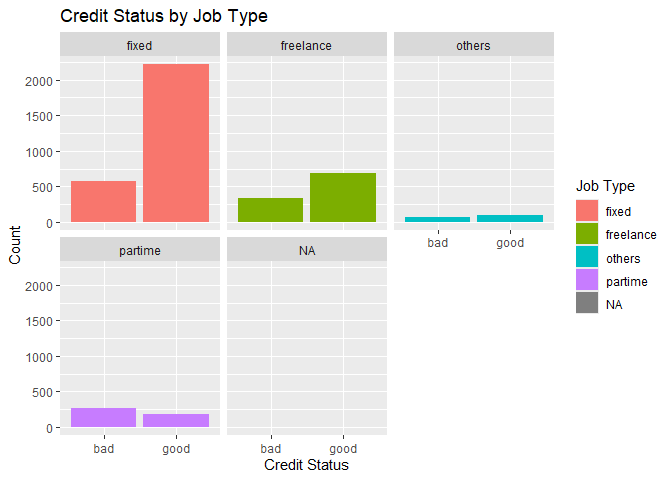
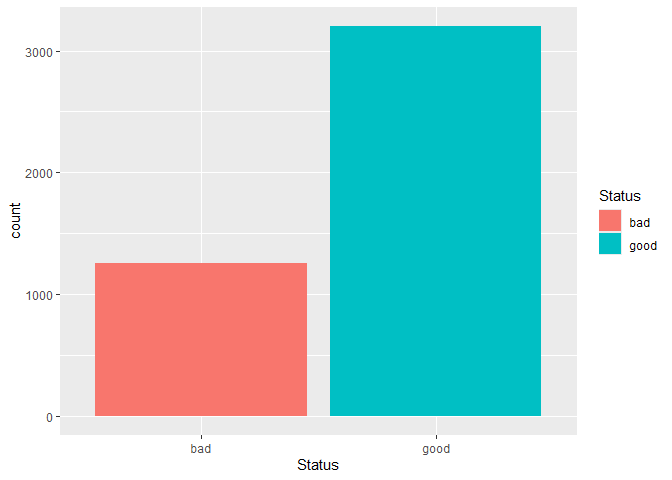
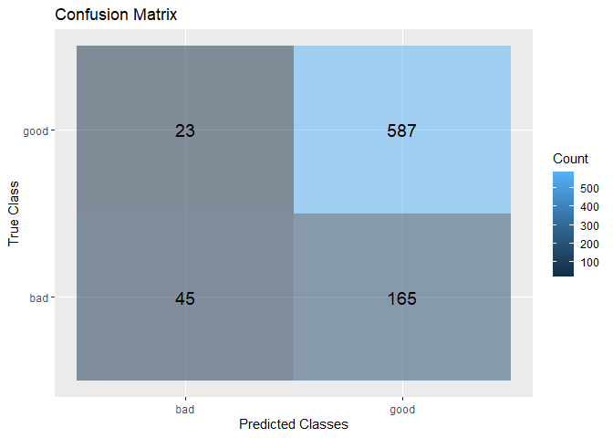
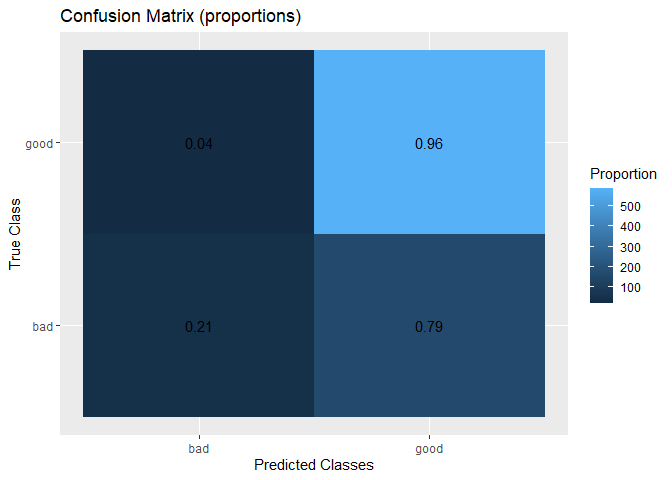
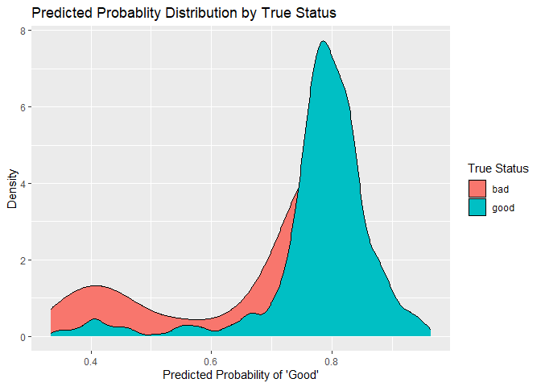
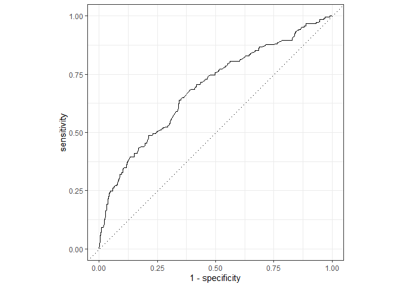

Homework: Building and Evaluating a Classification Model
================
Patrick Torralba
04/07/2026

- [Overview](#overview)
  - [Submission instructions](#submission-instructions)
- [Dataset](#dataset)
  - [Load and inspect the data](#load-and-inspect-the-data)
  - [Initial orientation](#initial-orientation)
  - [The dataset has 4454 rows and 14 columns. Most of the variables are
    numerical but a handful such as status, home, marital, records, and
    job are categorical predictors. The outcome is categorical (e.g good
    / bad). Variables that are useful for prediction include job,
    expenses, income, assests, debt, amount, and
    price.](#the-dataset-has-4454-rows-and-14-columns-most-of-the-variables-are-numerical-but-a-handful-such-as-status-home-marital-records-and-job-are-categorical-predictors-the-outcome-is-categorical-eg-good--bad-variables-that-are-useful-for-prediction-include-job-expenses-income-assests-debt-amount-and-price)
- [Part 1: Understanding the Classification
  Problem](#part-1-understanding-the-classification-problem)
  - [1.1 Identify the outcome](#11-identify-the-outcome)
  - [1.2 Examine class balance](#12-examine-class-balance)
- [Part 2: Prepare the Data](#part-2-prepare-the-data)
  - [2.1 Create a train/test split](#21-create-a-traintest-split)
  - [2.2 Choose predictors](#22-choose-predictors)
- [Part 3: Build a Logistic Regression
  Classifier](#part-3-build-a-logistic-regression-classifier)
  - [3.1 Specify the model](#31-specify-the-model)
  - [3.2 Build a workflow](#32-build-a-workflow)
  - [3.3 Fit the model](#33-fit-the-model)
- [Part 4: Generate Predictions](#part-4-generate-predictions)
- [Part 5: Evaluate the Logistic Regression
  Model](#part-5-evaluate-the-logistic-regression-model)
  - [5.1 Confusion matrix](#51-confusion-matrix)
  - [5.2 Performance metrics](#52-performance-metrics)
- [Part 6: Visualize Model Performance with
  ggplot2](#part-6-visualize-model-performance-with-ggplot2)
  - [6.1 Confusion matrix heatmap using
    counts](#61-confusion-matrix-heatmap-using-counts)
  - [6.2 Confusion matrix heatmap using
    proportions](#62-confusion-matrix-heatmap-using-proportions)
  - [6.3 Probability distribution
    plot](#63-probability-distribution-plot)
- [Part 7: ROC Curve and AUC](#part-7-roc-curve-and-auc)
- [Part 8: Build a Second Model](#part-8-build-a-second-model)
  - [8.1 Specify and fit a decision
    tree](#81-specify-and-fit-a-decision-tree)
  - [8.2 Visualize the tree](#82-visualize-the-tree)
  - [8.3 Generate predictions for the
    tree](#83-generate-predictions-for-the-tree)
  - [8.4 Evaluate the tree](#84-evaluate-the-tree)
- [Part 9: Reflection](#part-9-reflection)
- [Submission](#submission)

``` r
library(tidymodels)
library(tidyverse)
library(modeldata)
library(rpart.plot)
library(psych)

set.seed(25)
```

# Overview

In this assignment, you will build a **classification workflow from
scratch** using a new dataset. AS with each homeowrk,w e are graduall
stepping back the scaffolding as you get stronger as individual
programmers. In this homework, you will need to make some modeling
choices on your own and explain them clearly.

Your work should show that you can:

- identify and describe a classification problem
- split data into training and testing sets
- build a classification model using `tidymodels`
- generate both class predictions and probability predictions
- evaluate a classifier with a confusion matrix, metrics, and an ROC
  curve
- create your own `ggplot2` visualizations of model performance
- compare two different classification models
- reflect on your modeling decisions

You should write code in the code chunks and write your written
responses in the spaces provided.

Before you begin the assignment:

1.  Knit this document and make sure it runs.
2.  Update the author name in the YAML.
3.  Commit and push your work regularly as you go.

## Submission instructions

- Complete this file by adding code and short written responses where
  requested.
- Knit to a GitHub (`md`) document.
- Submit both the `.Rmd` file and the knitted `.md` file by committing
  to your repository.

# Dataset

For this homework, use the **`credit_data`** dataset from the
`modeldata` package.

The outcome you will model is whether an applicant is a **good** or
**bad** credit risk.

## Load and inspect the data

Use the chunk below to load the data and inspect its structure.

``` r
data(credit_data)
glimpse(credit_data)
```

    ## Rows: 4,454
    ## Columns: 14
    ## $ Status    <fct> good, good, bad, good, good, good, good, good, good, bad, go…
    ## $ Seniority <int> 9, 17, 10, 0, 0, 1, 29, 9, 0, 0, 6, 7, 8, 19, 0, 0, 15, 33, …
    ## $ Home      <fct> rent, rent, owner, rent, rent, owner, owner, parents, owner,…
    ## $ Time      <int> 60, 60, 36, 60, 36, 60, 60, 12, 60, 48, 48, 36, 60, 36, 18, …
    ## $ Age       <int> 30, 58, 46, 24, 26, 36, 44, 27, 32, 41, 34, 29, 30, 37, 21, …
    ## $ Marital   <fct> married, widow, married, single, single, married, married, s…
    ## $ Records   <fct> no, no, yes, no, no, no, no, no, no, no, no, no, no, no, yes…
    ## $ Job       <fct> freelance, fixed, freelance, fixed, fixed, fixed, fixed, fix…
    ## $ Expenses  <int> 73, 48, 90, 63, 46, 75, 75, 35, 90, 90, 60, 60, 75, 75, 35, …
    ## $ Income    <int> 129, 131, 200, 182, 107, 214, 125, 80, 107, 80, 125, 121, 19…
    ## $ Assets    <int> 0, 0, 3000, 2500, 0, 3500, 10000, 0, 15000, 0, 4000, 3000, 5…
    ## $ Debt      <int> 0, 0, 0, 0, 0, 0, 0, 0, 0, 0, 0, 0, 2500, 260, 0, 0, 0, 2000…
    ## $ Amount    <int> 800, 1000, 2000, 900, 310, 650, 1600, 200, 1200, 1200, 1150,…
    ## $ Price     <int> 846, 1658, 2985, 1325, 910, 1645, 1800, 1093, 1957, 1468, 15…

## Initial orientation

In a few sentences, describe what you notice about the dataset.

Prompt yourself with these questions:

- What is the name of the outcome variable?
- Is the outcome categorical or numeric?
- Do you see a mix of numeric and categorical predictors?
- Does anything stand out as potentially useful for prediction?

**Response:**

## The dataset has 4454 rows and 14 columns. Most of the variables are numerical but a handful such as status, home, marital, records, and job are categorical predictors. The outcome is categorical (e.g good / bad). Variables that are useful for prediction include job, expenses, income, assests, debt, amount, and price.

# Part 1: Understanding the Classification Problem

## 1.1 Identify the outcome

Write code that helps you explore the outcome variable.

Your code should:

- identify the outcome variable
- show its values
- help you determine whether this is a classification problem

``` r
summary(credit_data$Status)
```

    ##  bad good 
    ## 1254 3200

``` r
ggplot(credit_data, aes(x = Status, fill = Job)) +
  geom_bar() +
  facet_wrap(~ Job) +
  labs(x = "Credit Status",
       y = "Count",
       fill = "Job Type",
       title = "Credit Status by Job Type")
```

<!-- -->

After running your code, answer the following:

1.  What is the name of the outcome variable?
2.  What are the possible classes?
3.  Why is this a classification problem rather than a regression
    problem?

**Response:**

The name of the outcome variable is Status. The possible classes are
either good or bad. This is a classification problem because Status is a
binary variable - it can only be good or bad - and we are interested in
predicting the probability of an individual either being classified into
good or bad.

## 1.2 Examine class balance

Create:

- a table of the outcome variable
- a bar plot of the outcome variable

``` r
credit_data %>% 
  count(Status) %>% 
  mutate(Percent = (n / sum(n)) *100)
```

    ##   Status    n  Percent
    ## 1    bad 1254 28.15447
    ## 2   good 3200 71.84553

``` r
ggplot(credit_data, aes(x = Status, fill = Status)) +
  geom_bar()
```

<!-- -->

Then answer:

- Is the dataset balanced across the two classes, or is one class more
  common?
- Why might class balance matter when evaluating a classifier?
- Why might accuracy be misleading if one class is much more common?

**Response:**

The dataset is not balanced. There are more people with good credit than
bad credit. Class balance matters when evaluating because this directly
impacts accuracy. To be specific, since the classes are imbalanced, a
logistic regression model only learns to predict the majority class
(good), and not the minority class (bad). Accuracy may be misleading
because we can only be accurate pertaining to the good credit since we
have alot of data on it. But, we cannot be accurate on the bad credit
since there isn’t alot of data to go off of.

------------------------------------------------------------------------

# Part 2: Prepare the Data

## 2.1 Create a train/test split

Split the data into **training** and **testing** sets.

Expectations:

- Use an 80/20 split.
- Use `set.seed(123)` if needed again.
- Use **stratification on the outcome variable** so that class
  proportions are preserved.

``` r
set.seed(123)

data_split <- initial_split(credit_data,
                    prop = 0.80,
                    strata = Status)

train_data <- training(data_split)

test_data <- testing(data_split)
```

Then answer:

- Why do we split data into training and testing sets?
- Why is stratifying on the outcome useful in this case?

**Response:**

We split data into training and testing datasets because we are trying
to train the model by using the training data. And then we assess the
model by verifying it with the testing data. Stratifying is useful
because it ensures that we have an equal distribution of Status across
both datasets.

## 2.2 Choose predictors

You will begin by building a **logistic regression model** using **at
least 3 predictors** of your choice.

Before you write the model, briefly explain:

- which predictors you plan to use
- why you chose them
- whether there are any variables you intentionally decided not to use

You do **not** need to choose the “best” predictors, but your choices
should be thoughtful and clearly explained.

**Response:**

I choose the following predictor variables: Income, Debt, and Job. I
selected these variables because I believe they can strongly influence
an individual’s credit status. For example, an individual’s job and
income direclty impacts their spending habits, and thus to a degree,
their credit status. I chose not to use variables like age, marital, and
seniority because I felt that they weren’t as powerful predictors as the
the aforementioend selected variables.

------------------------------------------------------------------------

# Part 3: Build a Logistic Regression Classifier

## 3.1 Specify the model

Create a **logistic regression specification** using `tidymodels`.

``` r
log_spec <- logistic_reg() %>% 
  set_engine("glm") %>% 
  set_mode("classification") 
```

## 3.2 Build a workflow

Create a workflow that:

- adds your model
- adds a formula with the outcome and your chosen predictors

``` r
log_workflow <- workflow() %>% 
  add_model(log_spec) %>% 
  add_formula(Status ~ Income + Job + Debt)

log_workflow
```

    ## ══ Workflow ════════════════════════════════════════════════════════════════════
    ## Preprocessor: Formula
    ## Model: logistic_reg()
    ## 
    ## ── Preprocessor ────────────────────────────────────────────────────────────────
    ## Status ~ Income + Job + Debt
    ## 
    ## ── Model ───────────────────────────────────────────────────────────────────────
    ## Logistic Regression Model Specification (classification)
    ## 
    ## Computational engine: glm

## 3.3 Fit the model

Fit your workflow on the training data.

``` r
log_fit <- log_workflow %>% 
  fit(data = credit_data)


log_fit
```

    ## ══ Workflow [trained] ══════════════════════════════════════════════════════════
    ## Preprocessor: Formula
    ## Model: logistic_reg()
    ## 
    ## ── Preprocessor ────────────────────────────────────────────────────────────────
    ## Status ~ Income + Job + Debt
    ## 
    ## ── Model ───────────────────────────────────────────────────────────────────────
    ## 
    ## Call:  stats::glm(formula = ..y ~ ., family = stats::binomial, data = data)
    ## 
    ## Coefficients:
    ##  (Intercept)        Income  Jobfreelance     Jobothers    Jobpartime  
    ##    0.7887455     0.0045931    -0.2695671    -0.7958487    -1.6497260  
    ##         Debt  
    ##   -0.0000644  
    ## 
    ## Degrees of Freedom: 4061 Total (i.e. Null);  4056 Residual
    ##   (392 observations deleted due to missingness)
    ## Null Deviance:       4602 
    ## Residual Deviance: 4255  AIC: 4267

Then answer:

- Why are we fitting on the training set and not the full dataset?
- What is the benefit of keeping the model and formula inside a
  workflow?

**Response:**

We are fitting data on the training set only because we are training our
model to recognize patterns. If we used the entire dataset then we’d
have no test data to verify our model since the model has access to the
entire dataset. The benefit of keeping the model and formula inside a
workflow is that we can apply this model to different datasets (e.g
another credit_data dataset).

------------------------------------------------------------------------

# Part 4: Generate Predictions

Use your fitted logistic regression model to generate predictions on the
**test** set.

You should generate:

- predicted probabilities
- predicted classes

Then combine those predictions with the original test data.

``` r
log_credit_status_preds <- predict(log_fit, new_data = test_data)

log_credit_prob_preds <-predict(log_fit, new_data = test_data, type = "prob")

log_results <- test_data %>% 
  select(Status) %>% 
  bind_cols(log_credit_status_preds, log_credit_prob_preds)


log_results
```

    ##     Status .pred_class  .pred_bad .pred_good
    ## 1      bad        good 0.19188612  0.8081139
    ## 2     good        good 0.20377188  0.7962281
    ## 3     good        good 0.26685434  0.7331457
    ## 4      bad         bad 0.56558882  0.4344112
    ## 5     good        good 0.19497501  0.8050250
    ## 6      bad        good 0.23520325  0.7647967
    ## 7     good        good 0.22007868  0.7799213
    ## 8     good        good 0.21132561  0.7886744
    ## 9     good        good 0.19497501  0.8050250
    ## 10     bad        good 0.22308438  0.7769156
    ## 11     bad        good 0.20154532  0.7984547
    ## 12    good        good 0.10236006  0.8976399
    ## 13     bad        good 0.27319157  0.7268084
    ## 14    good        good 0.15956920  0.8404308
    ## 15    good        good 0.20302767  0.7969723
    ## 16    good        good 0.17227704  0.8277230
    ## 17    good        good 0.22303670  0.7769633
    ## 18    good        good 0.08195065  0.9180494
    ## 19     bad        good 0.19425508  0.8057449
    ## 20    good        good 0.20007108  0.7999289
    ## 21     bad         bad 0.50855421  0.4914458
    ## 22    good        good 0.21104094  0.7889591
    ## 23    good        good 0.16267317  0.8373268
    ## 24    good        good 0.16906545  0.8309345
    ## 25    good        good 0.20451812  0.7954819
    ## 26    good        good 0.20678406  0.7932159
    ## 27    good        good 0.07043284  0.9295672
    ## 28    good        good 0.21122543  0.7887746
    ## 29    good        good 0.21908230  0.7809177
    ## 30    good        good 0.21727202  0.7827280
    ## 31    good        good 0.06335659  0.9366434
    ## 32    good        good 0.15876358  0.8412364
    ## 33    good        <NA>         NA         NA
    ## 34    good        good 0.21363130  0.7863687
    ## 35    good        good 0.23437803  0.7656220
    ## 36    good        good 0.17557656  0.8244234
    ## 37     bad        good 0.19425508  0.8057449
    ## 38    good        good 0.10652222  0.8934778
    ## 39     bad        good 0.21286071  0.7871393
    ## 40    good        good 0.13043566  0.8695643
    ## 41    good        good 0.17892562  0.8210744
    ## 42    good        good 0.24874751  0.7512525
    ## 43    good        good 0.16267317  0.8373268
    ## 44     bad         bad 0.63913560  0.3608644
    ## 45    good        good 0.18997791  0.8100221
    ## 46    good        good 0.17097104  0.8290290
    ## 47    good        good 0.09540508  0.9045949
    ## 48    good        good 0.14879127  0.8512087
    ## 49    good        good 0.18095892  0.8190411
    ## 50    good        good 0.16130395  0.8386960
    ## 51     bad         bad 0.61443013  0.3855699
    ## 52     bad        good 0.14533457  0.8546654
    ## 53    good         bad 0.60022433  0.3997757
    ## 54    good        good 0.17671594  0.8232841
    ## 55     bad        good 0.45365138  0.5463486
    ## 56    good        good 0.15350540  0.8464946
    ## 57    good        good 0.09810614  0.9018939
    ## 58     bad        good 0.35663453  0.6433655
    ## 59    good        good 0.23660195  0.7633981
    ## 60    good        good 0.17227704  0.8277230
    ## 61     bad        good 0.23002938  0.7699706
    ## 62     bad        <NA>         NA         NA
    ## 63    good        good 0.20154532  0.7984547
    ## 64    good        good 0.24670139  0.7532986
    ## 65    good        good 0.19613687  0.8038631
    ## 66    good        good 0.17258632  0.8274137
    ## 67    good        good 0.20171239  0.7982876
    ## 68     bad        good 0.22842256  0.7715774
    ## 69    good        good 0.42315830  0.5768417
    ## 70    good        good 0.44577019  0.5542298
    ## 71     bad        good 0.26533896  0.7346610
    ## 72    good        good 0.19933700  0.8006630
    ## 73    good        good 0.25473454  0.7452655
    ## 74     bad        good 0.11021014  0.8897899
    ## 75     bad        good 0.14763156  0.8523684
    ## 76    good        good 0.11386543  0.8861346
    ## 77    good        good 0.23412214  0.7658779
    ## 78    good        good 0.20919344  0.7908066
    ## 79    good        good 0.19787491  0.8021251
    ## 80     bad        good 0.45595911  0.5440409
    ## 81     bad        <NA>         NA         NA
    ## 82    good        good 0.18577320  0.8142268
    ## 83    good        good 0.22463265  0.7753674
    ## 84     bad         bad 0.61985631  0.3801437
    ## 85    good        good 0.32913739  0.6708626
    ## 86     bad        good 0.20731147  0.7926885
    ## 87    good        <NA>         NA         NA
    ## 88    good        good 0.17892562  0.8210744
    ## 89     bad        good 0.14995848  0.8500415
    ## 90     bad        good 0.33056084  0.6694392
    ## 91     bad         bad 0.65278981  0.3472102
    ## 92     bad        good 0.21209214  0.7879079
    ## 93    good        good 0.18232443  0.8176756
    ## 94     bad        <NA>         NA         NA
    ## 95    good        good 0.24103596  0.7589640
    ## 96     bad        good 0.22704174  0.7729583
    ## 97    good        good 0.16392831  0.8360717
    ## 98    good        good 0.19787491  0.8021251
    ## 99    good        good 0.20526639  0.7947336
    ## 100    bad        good 0.26088638  0.7391136
    ## 101   good        good 0.24022181  0.7597782
    ## 102   good        good 0.23109729  0.7689027
    ## 103   good        good 0.06748432  0.9325157
    ## 104   good        <NA>         NA         NA
    ## 105   good        good 0.22965257  0.7703474
    ## 106    bad        good 0.17227704  0.8277230
    ## 107    bad         bad 0.52461104  0.4753890
    ## 108    bad        good 0.17825183  0.8217482
    ## 109   good        good 0.23935945  0.7606405
    ## 110   good        good 0.17491270  0.8250873
    ## 111   good         bad 0.53628635  0.4637136
    ## 112   good        good 0.22358592  0.7764141
    ## 113   good        good 0.22303670  0.7769633
    ## 114   good        good 0.18577320  0.8142268
    ## 115   good        good 0.19139557  0.8086044
    ## 116    bad        good 0.22865790  0.7713421
    ## 117   good        good 0.18835012  0.8116499
    ## 118   good        good 0.14763156  0.8523684
    ## 119   good        good 0.12297199  0.8770280
    ## 120   good        good 0.15272483  0.8472752
    ## 121   good        good 0.30888766  0.6911123
    ## 122   good        good 0.21829750  0.7817025
    ## 123   good        good 0.12955806  0.8704419
    ## 124   good        good 0.18301018  0.8169898
    ## 125    bad        good 0.33627529  0.6637247
    ## 126   good        good 0.19046568  0.8095343
    ## 127   good        good 0.18740369  0.8125963
    ## 128   good        good 0.23002938  0.7699706
    ## 129    bad         bad 0.60791387  0.3920861
    ## 130   good        good 0.20526639  0.7947336
    ## 131    bad         bad 0.58247843  0.4175216
    ## 132   good        good 0.20080719  0.7991928
    ## 133   good        good 0.26416718  0.7358328
    ## 134   good        good 0.05117614  0.9488239
    ## 135   good        good 0.19517921  0.8048208
    ## 136   good        good 0.23437803  0.7656220
    ## 137   good        good 0.11432970  0.8856703
    ## 138   good        good 0.28240593  0.7175941
    ## 139    bad        good 0.28280671  0.7171933
    ## 140   good        good 0.13043566  0.8695643
    ## 141   good        good 0.23002938  0.7699706
    ## 142   good        good 0.18577320  0.8142268
    ## 143   good        good 0.17892562  0.8210744
    ## 144   good        good 0.18027916  0.8197208
    ## 145   good        good 0.19853696  0.8014630
    ## 146   good        good 0.13007692  0.8699231
    ## 147    bad        <NA>         NA         NA
    ## 148   good        good 0.19692121  0.8030788
    ## 149   good        good 0.24782179  0.7521782
    ## 150   good        good 0.06748432  0.9325157
    ## 151   good        good 0.21673398  0.7832660
    ## 152   good        good 0.18322137  0.8167786
    ## 153    bad        good 0.22303670  0.7769633
    ## 154   good        good 0.26444457  0.7355554
    ## 155   good        good 0.18927210  0.8107279
    ## 156   good        good 0.17359092  0.8264091
    ## 157   good        good 0.25212746  0.7478725
    ## 158   good        good 0.21363130  0.7863687
    ## 159   good        good 0.29945751  0.7005425
    ## 160   good        good 0.21956044  0.7804396
    ## 161    bad        good 0.21440393  0.7855961
    ## 162    bad         bad 0.57009733  0.4299027
    ## 163   good        good 0.17630822  0.8236918
    ## 164   good        good 0.16582561  0.8341744
    ## 165    bad        good 0.22303670  0.7769633
    ## 166   good        good 0.34142019  0.6585798
    ## 167   good        good 0.23935945  0.7606405
    ## 168   good        good 0.20377188  0.7962281
    ## 169   good        good 0.12635464  0.8736454
    ## 170   good        good 0.04786724  0.9521328
    ## 171   good        good 0.14345598  0.8565440
    ## 172    bad        <NA>         NA         NA
    ## 173   good        <NA>         NA         NA
    ## 174   good        good 0.22463265  0.7753674
    ## 175   good        good 0.24606816  0.7539318
    ## 176   good        good 0.19282129  0.8071787
    ## 177    bad        good 0.24782179  0.7521782
    ## 178   good        good 0.16080499  0.8391950
    ## 179   good        <NA>         NA         NA
    ## 180   good        good 0.32668834  0.6733117
    ## 181   good        good 0.21416375  0.7858363
    ## 182   good        good 0.28549762  0.7145024
    ## 183   good        good 0.13111995  0.8688801
    ## 184   good        good 0.27319157  0.7268084
    ## 185   good        good 0.18301018  0.8169898
    ## 186   good        good 0.24356570  0.7564343
    ## 187   good        good 0.20377188  0.7962281
    ## 188    bad         bad 0.62632829  0.3736717
    ## 189   good        good 0.15876358  0.8412364
    ## 190   good        good 0.09343896  0.9065610
    ## 191   good        good 0.20228548  0.7977145
    ## 192    bad         bad 0.58800836  0.4119916
    ## 193   good        good 0.16204851  0.8379515
    ## 194   good        good 0.23443564  0.7655644
    ## 195   good        good 0.20007108  0.7999289
    ## 196    bad        good 0.20377188  0.7962281
    ## 197   good        good 0.21250737  0.7874926
    ## 198   good        good 0.22303670  0.7769633
    ## 199   good        good 0.24696660  0.7530334
    ## 200   good        good 0.21517858  0.7848214
    ## 201   good        good 0.17892562  0.8210744
    ## 202    bad         bad 0.63168740  0.3683126
    ## 203   good        good 0.25648243  0.7435176
    ## 204   good        good 0.19188612  0.8081139
    ## 205   good        good 0.12597520  0.8740248
    ## 206   good        good 0.20903818  0.7909618
    ## 207   good        good 0.12618875  0.8738112
    ## 208    bad        good 0.30235614  0.6976439
    ## 209   good        good 0.10578594  0.8942141
    ## 210   good        good 0.20830245  0.7916976
    ## 211    bad         bad 0.53033503  0.4696650
    ## 212    bad        good 0.24526217  0.7547378
    ## 213    bad        good 0.32107542  0.6789246
    ## 214    bad        good 0.20377188  0.7962281
    ## 215    bad         bad 0.60788108  0.3921189
    ## 216   good        good 0.16080499  0.8391950
    ## 217    bad        <NA>         NA         NA
    ## 218   good        good 0.15895420  0.8410458
    ## 219    bad        good 0.22224177  0.7777582
    ## 220    bad        good 0.20827976  0.7917202
    ## 221    bad        <NA>         NA         NA
    ## 222   good        good 0.21751473  0.7824853
    ## 223   good        good 0.18577320  0.8142268
    ## 224    bad        good 0.11021014  0.8897899
    ## 225   good        good 0.21209214  0.7879079
    ## 226    bad        good 0.22303670  0.7769633
    ## 227   good        good 0.20804462  0.7919554
    ## 228   good        good 0.16499460  0.8350054
    ## 229    bad        good 0.18802491  0.8119751
    ## 230   good        good 0.05647980  0.9435202
    ## 231   good        good 0.22144886  0.7785511
    ## 232   good        good 0.22303670  0.7769633
    ## 233   good        good 0.22610319  0.7738968
    ## 234   good        good 0.43327943  0.5667206
    ## 235   good        good 0.19432687  0.8056731
    ## 236   good        good 0.14763156  0.8523684
    ## 237   good        good 0.21597856  0.7840214
    ## 238    bad        good 0.24782179  0.7521782
    ## 239   good        good 0.20007108  0.7999289
    ## 240   good        good 0.33789757  0.6621024
    ## 241   good        good 0.32913739  0.6708626
    ## 242   good        good 0.14881450  0.8511855
    ## 243    bad        good 0.25911894  0.7408811
    ## 244    bad        good 0.15876358  0.8412364
    ## 245   good        good 0.16902680  0.8309732
    ## 246   good        good 0.19425508  0.8057449
    ## 247   good        good 0.24611339  0.7538866
    ## 248   good        good 0.24670139  0.7532986
    ## 249   good        good 0.34929190  0.6507081
    ## 250   good        good 0.19282129  0.8071787
    ## 251    bad        good 0.46508781  0.5349122
    ## 252   good        good 0.14363135  0.8563686
    ## 253   good        good 0.23109729  0.7689027
    ## 254    bad        good 0.23437803  0.7656220
    ## 255    bad        good 0.27585473  0.7241453
    ## 256   good        good 0.17557656  0.8244234
    ## 257   good        good 0.21751473  0.7824853
    ## 258   good         bad 0.52919082  0.4708092
    ## 259   good         bad 0.59245186  0.4075481
    ## 260    bad        good 0.20601669  0.7939833
    ## 261   good        good 0.21517858  0.7848214
    ## 262   good        good 0.17293299  0.8270670
    ## 263   good        good 0.23273364  0.7672664
    ## 264   good        good 0.25648243  0.7435176
    ## 265   good        good 0.22385756  0.7761424
    ## 266   good         bad 0.55066472  0.4493353
    ## 267   good        good 0.21132561  0.7886744
    ## 268   good        good 0.16392831  0.8360717
    ## 269    bad        good 0.15454638  0.8454536
    ## 270    bad        good 0.20007108  0.7999289
    ## 271   good        good 0.19860495  0.8013951
    ## 272    bad        good 0.45368131  0.5463187
    ## 273   good        good 0.03548194  0.9645181
    ## 274    bad        good 0.15956920  0.8404308
    ## 275    bad        good 0.15681984  0.8431802
    ## 276    bad        good 0.08655655  0.9134434
    ## 277   good        good 0.23109729  0.7689027
    ## 278   good        good 0.22946901  0.7705310
    ## 279   good        good 0.26177301  0.7382270
    ## 280   good        good 0.32610202  0.6738980
    ## 281   good        good 0.20377188  0.7962281
    ## 282   good        good 0.23935945  0.7606405
    ## 283   good        good 0.17825183  0.8217482
    ## 284   good         bad 0.58019801  0.4198020
    ## 285    bad        good 0.18438768  0.8156123
    ## 286   good        good 0.22623668  0.7737633
    ## 287    bad        <NA>         NA         NA
    ## 288   good        good 0.16902680  0.8309732
    ## 289   good        good 0.27039035  0.7296096
    ## 290    bad        good 0.22303670  0.7769633
    ## 291   good        good 0.26355211  0.7364479
    ## 292   good        good 0.19877748  0.8012225
    ## 293    bad        <NA>         NA         NA
    ## 294   good        good 0.17491270  0.8250873
    ## 295   good        good 0.10882397  0.8911760
    ## 296   good        good 0.22424421  0.7757558
    ## 297   good        good 0.17560975  0.8243903
    ## 298   good        good 0.20154532  0.7984547
    ## 299   good        good 0.12597520  0.8740248
    ## 300   good         bad 0.64546710  0.3545329
    ## 301   good        good 0.22144886  0.7785511
    ## 302    bad        good 0.33320679  0.6667932
    ## 303    bad        good 0.30010352  0.6998965
    ## 304   good        good 0.08522608  0.9147739
    ## 305   good        good 0.26685434  0.7331457
    ## 306   good        good 0.21286071  0.7871393
    ## 307    bad        good 0.18099970  0.8190003
    ## 308   good        good 0.24019670  0.7598033
    ## 309    bad        good 0.16774046  0.8322595
    ## 310   good         bad 0.65278981  0.3472102
    ## 311    bad        good 0.19984287  0.8001571
    ## 312    bad         bad 0.65278981  0.3472102
    ## 313   good         bad 0.56784448  0.4321555
    ## 314    bad        <NA>         NA         NA
    ## 315    bad        good 0.17892562  0.8210744
    ## 316   good        good 0.19860495  0.8013951
    ## 317    bad         bad 0.56784448  0.4321555
    ## 318   good        good 0.41868012  0.5813199
    ## 319   good        good 0.19569695  0.8043030
    ## 320    bad        good 0.24782179  0.7521782
    ## 321    bad        good 0.16020464  0.8397954
    ## 322   good        good 0.21517858  0.7848214
    ## 323    bad        good 0.23193896  0.7680610
    ## 324   good        good 0.16774046  0.8322595
    ## 325    bad        good 0.11156867  0.8884313
    ## 326   good        good 0.33116894  0.6688311
    ## 327   good        good 0.22144886  0.7785511
    ## 328   good        good 0.20377188  0.7962281
    ## 329   good        good 0.46383546  0.5361645
    ## 330   good        good 0.28881023  0.7111898
    ## 331   good        good 0.23109729  0.7689027
    ## 332   good        good 0.21832880  0.7816712
    ## 333   good        good 0.24584880  0.7541512
    ## 334   good        good 0.12100421  0.8789958
    ## 335   good        good 0.22224177  0.7777582
    ## 336   good        good 0.14705451  0.8529455
    ## 337   good        good 0.19353718  0.8064628
    ## 338   good        good 0.19282129  0.8071787
    ## 339   good        good 0.25648243  0.7435176
    ## 340   good        good 0.26416718  0.7358328
    ## 341   good        <NA>         NA         NA
    ## 342   good        <NA>         NA         NA
    ## 343   good        good 0.14306732  0.8569327
    ## 344    bad        good 0.20110705  0.7988929
    ## 345   good        good 0.11023712  0.8897629
    ## 346   good        good 0.12597520  0.8740248
    ## 347    bad        <NA>         NA         NA
    ## 348    bad         bad 0.63701419  0.3629858
    ## 349   good        good 0.13482656  0.8651734
    ## 350   good        good 0.19863414  0.8013659
    ## 351   good        good 0.25212746  0.7478725
    ## 352   good         bad 0.59356040  0.4064396
    ## 353   good        good 0.17892562  0.8210744
    ## 354    bad        good 0.18716673  0.8128333
    ## 355   good        good 0.27319157  0.7268084
    ## 356   good        good 0.18577320  0.8142268
    ## 357   good        good 0.20676902  0.7932310
    ## 358   good        good 0.12597520  0.8740248
    ## 359    bad        <NA>         NA         NA
    ## 360    bad        good 0.12247748  0.8775225
    ## 361   good        <NA>         NA         NA
    ## 362   good        good 0.17491270  0.8250873
    ## 363   good        good 0.24022181  0.7597782
    ## 364   good        good 0.26673491  0.7332651
    ## 365    bad        good 0.27319157  0.7268084
    ## 366   good        good 0.22865790  0.7713421
    ## 367    bad        good 0.21517858  0.7848214
    ## 368   good        good 0.45140545  0.5485946
    ## 369   good        good 0.18095892  0.8190411
    ## 370   good        <NA>         NA         NA
    ## 371   good        <NA>         NA         NA
    ## 372   good        good 0.10278286  0.8972171
    ## 373   good        good 0.24526217  0.7547378
    ## 374   good        good 0.19714690  0.8028531
    ## 375   good        good 0.29568438  0.7043156
    ## 376   good        good 0.19910942  0.8008906
    ## 377   good        good 0.15350540  0.8464946
    ## 378   good        good 0.15470288  0.8452971
    ## 379    bad        good 0.24743395  0.7525660
    ## 380   good         bad 0.61877342  0.3812266
    ## 381   good        good 0.14977673  0.8502233
    ## 382   good        good 0.07734929  0.9226507
    ## 383   good        good 0.23437803  0.7656220
    ## 384    bad        good 0.18577320  0.8142268
    ## 385   good        good 0.23494674  0.7650533
    ## 386    bad        good 0.28652922  0.7134708
    ## 387    bad        good 0.20279694  0.7972031
    ## 388   good        <NA>         NA         NA
    ## 389   good        good 0.15956920  0.8404308
    ## 390    bad        <NA>         NA         NA
    ## 391   good        good 0.17032100  0.8296790
    ## 392   good        good 0.18786651  0.8121335
    ## 393    bad        <NA>         NA         NA
    ## 394   good        good 0.10278286  0.8972171
    ## 395   good        good 0.21517858  0.7848214
    ## 396    bad         bad 0.54517641  0.4548236
    ## 397    bad        <NA>         NA         NA
    ## 398   good        good 0.18577320  0.8142268
    ## 399   good        good 0.22303670  0.7769633
    ## 400   good        good 0.20752338  0.7924766
    ## 401    bad         bad 0.58775904  0.4122410
    ## 402    bad        good 0.23439449  0.7656055
    ## 403   good        good 0.25735931  0.7426407
    ## 404   good        good 0.25648243  0.7435176
    ## 405   good        good 0.20979862  0.7902014
    ## 406   good        good 0.16774046  0.8322595
    ## 407   good        good 0.23109729  0.7689027
    ## 408   good        good 0.20752338  0.7924766
    ## 409   good        good 0.18057254  0.8194275
    ## 410   good        good 0.12036540  0.8796346
    ## 411   good        good 0.23000353  0.7699965
    ## 412    bad        good 0.19282129  0.8071787
    ## 413    bad        good 0.27319157  0.7268084
    ## 414   good         bad 0.60239362  0.3976064
    ## 415   good        good 0.16582561  0.8341744
    ## 416    bad        <NA>         NA         NA
    ## 417   good        good 0.12597520  0.8740248
    ## 418    bad        good 0.23826519  0.7617348
    ## 419   good        good 0.24782179  0.7521782
    ## 420   good        good 0.14741665  0.8525833
    ## 421   good        good 0.13165984  0.8683402
    ## 422   good        good 0.19353718  0.8064628
    ## 423   good        good 0.17425082  0.8257492
    ## 424   good        good 0.20804462  0.7919554
    ## 425   good        good 0.22946901  0.7705310
    ## 426   good        good 0.24108629  0.7589137
    ## 427   good        good 0.23191446  0.7680855
    ## 428   good        good 0.14647933  0.8535207
    ## 429   good        good 0.20955344  0.7904466
    ## 430   good        good 0.26533896  0.7346610
    ## 431   good        good 0.35663453  0.6433655
    ## 432   good        good 0.27319157  0.7268084
    ## 433    bad         bad 0.57122268  0.4287773
    ## 434    bad        <NA>         NA         NA
    ## 435   good        good 0.18577320  0.8142268
    ## 436   good        good 0.24782179  0.7521782
    ## 437    bad         bad 0.55313649  0.4468635
    ## 438    bad        good 0.24441294  0.7555871
    ## 439   good        good 0.18577320  0.8142268
    ## 440   good        good 0.12531389  0.8746861
    ## 441    bad        <NA>         NA         NA
    ## 442   good        good 0.16838265  0.8316173
    ## 443   good        good 0.25212746  0.7478725
    ## 444   good        good 0.21845899  0.7815410
    ## 445   good        good 0.17227704  0.8277230
    ## 446   good        good 0.18999908  0.8100009
    ## 447    bad        good 0.26533896  0.7346610
    ## 448    bad        good 0.23109729  0.7689027
    ## 449   good        good 0.22303670  0.7769633
    ## 450   good        good 0.18577320  0.8142268
    ## 451   good        good 0.20676902  0.7932310
    ## 452   good        good 0.25533617  0.7446638
    ## 453   good        <NA>         NA         NA
    ## 454   good        good 0.18027916  0.8197208
    ## 455   good        good 0.37259395  0.6274061
    ## 456   good        good 0.24356570  0.7564343
    ## 457   good        good 0.23935945  0.7606405
    ## 458   good        good 0.22543365  0.7745663
    ## 459   good        good 0.17227704  0.8277230
    ## 460    bad         bad 0.58243382  0.4175662
    ## 461   good        good 0.18369793  0.8163021
    ## 462    bad        <NA>         NA         NA
    ## 463   good        good 0.20827976  0.7917202
    ## 464    bad        good 0.31114642  0.6888536
    ## 465    bad         bad 0.54517641  0.4548236
    ## 466   good        good 0.14879127  0.8512087
    ## 467   good        good 0.17664819  0.8233518
    ## 468   good        good 0.16582561  0.8341744
    ## 469   good        good 0.17293299  0.8270670
    ## 470   good        good 0.23109729  0.7689027
    ## 471   good        good 0.26803369  0.7319663
    ## 472   good        good 0.20007108  0.7999289
    ## 473   good        good 0.16248619  0.8375138
    ## 474    bad        good 0.21831315  0.7816869
    ## 475    bad        good 0.29180630  0.7081937
    ## 476   good        good 0.25533617  0.7446638
    ## 477   good        good 0.15651339  0.8434866
    ## 478    bad        good 0.25126237  0.7487376
    ## 479   good        good 0.19282129  0.8071787
    ## 480   good        good 0.18997791  0.8100221
    ## 481    bad         bad 0.64230756  0.3576924
    ## 482   good        good 0.45698909  0.5430109
    ## 483   good        good 0.24526217  0.7547378
    ## 484   good        good 0.20302767  0.7969723
    ## 485    bad        good 0.29330886  0.7066911
    ## 486    bad        <NA>         NA         NA
    ## 487   good        good 0.17758004  0.8224200
    ## 488   good        <NA>         NA         NA
    ## 489    bad        good 0.24272046  0.7572795
    ## 490   good        good 0.21132561  0.7886744
    ## 491    bad        good 0.31114642  0.6888536
    ## 492    bad        good 0.10014049  0.8998595
    ## 493    bad        <NA>         NA         NA
    ## 494    bad        good 0.27319157  0.7268084
    ## 495   good        good 0.35930153  0.6406985
    ## 496   good        good 0.26718739  0.7328126
    ## 497   good        good 0.08091991  0.9190801
    ## 498   good        good 0.29180630  0.7081937
    ## 499    bad        good 0.22303670  0.7769633
    ## 500    bad        <NA>         NA         NA
    ## 501   good        good 0.18348411  0.8165159
    ## 502    bad        <NA>         NA         NA
    ## 503   good        good 0.22303670  0.7769633
    ## 504   good        good 0.21883833  0.7811617
    ## 505   good        <NA>         NA         NA
    ## 506   good        good 0.23520325  0.7647967
    ## 507   good         bad 0.62093800  0.3790620
    ## 508   good        good 0.11306613  0.8869339
    ## 509   good        good 0.21209214  0.7879079
    ## 510   good        good 0.21986912  0.7801309
    ## 511   good        good 0.24782179  0.7521782
    ## 512   good        good 0.23520325  0.7647967
    ## 513   good        good 0.23769095  0.7623090
    ## 514    bad        good 0.43994961  0.5600504
    ## 515   good        good 0.27241208  0.7275879
    ## 516   good        good 0.21517858  0.7848214
    ## 517   good        <NA>         NA         NA
    ## 518   good         bad 0.59908864  0.4009114
    ## 519   good        good 0.19642092  0.8035791
    ## 520   good        <NA>         NA         NA
    ## 521   good        good 0.23520325  0.7647967
    ## 522   good        good 0.16582561  0.8341744
    ## 523   good        good 0.14194479  0.8580552
    ## 524    bad        good 0.24094672  0.7590533
    ## 525    bad        <NA>         NA         NA
    ## 526    bad        good 0.32107542  0.6789246
    ## 527   good        good 0.19425508  0.8057449
    ## 528   good        good 0.23603048  0.7639695
    ## 529   good        good 0.24696660  0.7530334
    ## 530   good        good 0.15350540  0.8464946
    ## 531   good        good 0.21440393  0.7855961
    ## 532   good        <NA>         NA         NA
    ## 533   good        good 0.14687567  0.8531243
    ## 534   good        good 0.21911938  0.7808806
    ## 535   good        good 0.22463265  0.7753674
    ## 536   good        good 0.18577320  0.8142268
    ## 537   good        good 0.15054491  0.8494551
    ## 538    bad        good 0.21132561  0.7886744
    ## 539    bad        <NA>         NA         NA
    ## 540    bad        <NA>         NA         NA
    ## 541   good        good 0.26416718  0.7358328
    ## 542   good        good 0.25533617  0.7446638
    ## 543   good        good 0.17425082  0.8257492
    ## 544   good        good 0.19910942  0.8008906
    ## 545   good        good 0.23109729  0.7689027
    ## 546   good        good 0.18279698  0.8172030
    ## 547    bad        good 0.28147606  0.7185239
    ## 548   good        good 0.25039926  0.7496007
    ## 549   good        good 0.23852420  0.7614758
    ## 550    bad        good 0.26533896  0.7346610
    ## 551    bad        good 0.22865790  0.7713421
    ## 552    bad        good 0.26088638  0.7391136
    ## 553   good        good 0.33627529  0.6637247
    ## 554    bad        good 0.21908230  0.7809177
    ## 555    bad         bad 0.54631508  0.4536849
    ## 556   good        good 0.06976198  0.9302380
    ## 557   good        good 0.20377188  0.7962281
    ## 558   good        good 0.19282129  0.8071787
    ## 559   good        good 0.16455880  0.8354412
    ## 560    bad        good 0.23355483  0.7664452
    ## 561   good        good 0.24356570  0.7564343
    ## 562    bad        good 0.32812400  0.6718760
    ## 563   good        good 0.17892562  0.8210744
    ## 564   good        good 0.11156867  0.8884313
    ## 565   good        good 0.21517858  0.7848214
    ## 566    bad        <NA>         NA         NA
    ## 567   good        good 0.18577320  0.8142268
    ## 568    bad        good 0.22463265  0.7753674
    ## 569    bad        <NA>         NA         NA
    ## 570   good        good 0.10278286  0.8972171
    ## 571   good        good 0.25409494  0.7459051
    ## 572   good        good 0.28668904  0.7133110
    ## 573    bad        good 0.25648243  0.7435176
    ## 574   good        good 0.14515746  0.8548425
    ## 575   good        good 0.20752338  0.7924766
    ## 576   good        good 0.05680144  0.9431986
    ## 577   good        good 0.19714690  0.8028531
    ## 578    bad        good 0.25130551  0.7486945
    ## 579    bad        good 0.45026827  0.5497317
    ## 580   good        good 0.22303670  0.7769633
    ## 581   good        good 0.41087586  0.5891241
    ## 582    bad        <NA>         NA         NA
    ## 583    bad        good 0.23750522  0.7624948
    ## 584   good        good 0.11432970  0.8856703
    ## 585   good        good 0.34616657  0.6538334
    ## 586   good        good 0.21678069  0.7832193
    ## 587   good        good 0.19353718  0.8064628
    ## 588    bad        good 0.21908230  0.7809177
    ## 589   good        good 0.19659927  0.8034007
    ## 590   good        good 0.16395974  0.8360403
    ## 591   good        good 0.21751473  0.7824853
    ## 592   good        good 0.16499460  0.8350054
    ## 593   good        good 0.25359343  0.7464066
    ## 594   good        good 0.22840639  0.7715936
    ## 595   good        good 0.19933700  0.8006630
    ## 596   good        good 0.27319157  0.7268084
    ## 597    bad        good 0.15956920  0.8404308
    ## 598    bad        <NA>         NA         NA
    ## 599   good        good 0.19168859  0.8083114
    ## 600    bad        good 0.25212746  0.7478725
    ## 601    bad        good 0.40698942  0.5930106
    ## 602   good        good 0.24356570  0.7564343
    ## 603    bad         bad 0.59135345  0.4086466
    ## 604   good        good 0.16243430  0.8375657
    ## 605   good        <NA>         NA         NA
    ## 606   good         bad 0.58689521  0.4131048
    ## 607   good        good 0.08632821  0.9136718
    ## 608   good        <NA>         NA         NA
    ## 609   good        good 0.37474389  0.6252561
    ## 610    bad        <NA>         NA         NA
    ## 611    bad         bad 0.57800364  0.4219964
    ## 612   good        good 0.33792411  0.6620759
    ## 613    bad        good 0.24867897  0.7513210
    ## 614    bad        good 0.23273364  0.7672664
    ## 615    bad        <NA>         NA         NA
    ## 616   good        good 0.33465788  0.6653421
    ## 617    bad        good 0.22946901  0.7705310
    ## 618   good        good 0.28708314  0.7129169
    ## 619   good        good 0.13644200  0.8635580
    ## 620    bad        <NA>         NA         NA
    ## 621   good        good 0.17227704  0.8277230
    ## 622    bad        good 0.22464862  0.7753514
    ## 623    bad         bad 0.62954757  0.3704524
    ## 624    bad        good 0.15350540  0.8464946
    ## 625   good        good 0.23355483  0.7664452
    ## 626    bad        good 0.27962190  0.7203781
    ## 627   good        good 0.23437803  0.7656220
    ## 628   good        good 0.17097104  0.8290290
    ## 629   good        good 0.16267317  0.8373268
    ## 630   good        good 0.29849484  0.7015052
    ## 631   good        good 0.21416375  0.7858363
    ## 632   good        good 0.20228548  0.7977145
    ## 633    bad        good 0.22927359  0.7707264
    ## 634   good        <NA>         NA         NA
    ## 635   good        <NA>         NA         NA
    ## 636   good        good 0.23209121  0.7679088
    ## 637    bad        good 0.36617456  0.6338254
    ## 638   good        good 0.18027916  0.8197208
    ## 639   good        good 0.16582561  0.8341744
    ## 640    bad        good 0.20827976  0.7917202
    ## 641   good        good 0.20979862  0.7902014
    ## 642    bad         bad 0.62417586  0.3758241
    ## 643   good        good 0.23437803  0.7656220
    ## 644   good        good 0.22099935  0.7790007
    ## 645   good        good 0.22303670  0.7769633
    ## 646   good        good 0.14705451  0.8529455
    ## 647   good        good 0.23520325  0.7647967
    ## 648   good        good 0.26088638  0.7391136
    ## 649    bad        good 0.32904306  0.6709569
    ## 650    bad         bad 0.62960104  0.3703990
    ## 651   good        good 0.16519123  0.8348088
    ## 652   good        good 0.16481434  0.8351857
    ## 653   good        <NA>         NA         NA
    ## 654   good        good 0.27777524  0.7222248
    ## 655   good        good 0.24782179  0.7521782
    ## 656   good        good 0.25099409  0.7490059
    ## 657   good        good 0.20526639  0.7947336
    ## 658   good        good 0.20752338  0.7924766
    ## 659    bad        good 0.38339245  0.6166075
    ## 660   good        good 0.24356570  0.7564343
    ## 661   good        good 0.14937393  0.8506261
    ## 662   good        <NA>         NA         NA
    ## 663    bad        good 0.26254942  0.7374506
    ## 664   good        good 0.24356570  0.7564343
    ## 665   good        good 0.30042195  0.6995781
    ## 666   good        good 0.17020677  0.8297932
    ## 667   good        good 0.04877772  0.9512223
    ## 668   good        <NA>         NA         NA
    ## 669   good        good 0.23826519  0.7617348
    ## 670    bad        good 0.23935945  0.7606405
    ## 671    bad         bad 0.66663825  0.3333618
    ## 672   good        good 0.22144886  0.7785511
    ## 673   good        good 0.22303670  0.7769633
    ## 674   good        good 0.21132561  0.7886744
    ## 675   good        good 0.08345260  0.9165474
    ## 676   good        good 0.17346838  0.8265316
    ## 677   good        good 0.16902680  0.8309732
    ## 678   good        good 0.19282129  0.8071787
    ## 679   good        good 0.16838265  0.8316173
    ## 680   good        good 0.20752338  0.7924766
    ## 681    bad        <NA>         NA         NA
    ## 682   good        good 0.23769095  0.7623090
    ## 683   good        good 0.15410319  0.8458968
    ## 684    bad        good 0.23109729  0.7689027
    ## 685   good        good 0.30950929  0.6904907
    ## 686   good        good 0.22704174  0.7729583
    ## 687   good        good 0.22303670  0.7769633
    ## 688   good        good 0.23520325  0.7647967
    ## 689    bad        good 0.18164068  0.8183593
    ## 690   good         bad 0.65797665  0.3420234
    ## 691   good        good 0.13917059  0.8608294
    ## 692   good        good 0.18369793  0.8163021
    ## 693   good        good 0.26321168  0.7367883
    ## 694   good        good 0.22066586  0.7793341
    ## 695   good         bad 0.59135345  0.4086466
    ## 696   good        good 0.21805755  0.7819424
    ## 697   good        good 0.18577320  0.8142268
    ## 698   good        good 0.10623863  0.8937614
    ## 699   good        good 0.21577837  0.7842216
    ## 700    bad        good 0.33116894  0.6688311
    ## 701   good        good 0.17962842  0.8203716
    ## 702    bad        good 0.29426182  0.7057382
    ## 703    bad         bad 0.52700955  0.4729904
    ## 704   good         bad 0.55771842  0.4422816
    ## 705   good        good 0.38339245  0.6166075
    ## 706   good        good 0.20556777  0.7944322
    ## 707   good        good 0.23935945  0.7606405
    ## 708   good        good 0.13466024  0.8653398
    ## 709   good        good 0.23112592  0.7688741
    ## 710   good        good 0.30429736  0.6957026
    ## 711   good        good 0.36617456  0.6338254
    ## 712   good        good 0.20154532  0.7984547
    ## 713    bad        good 0.13698409  0.8630159
    ## 714   good        good 0.21550501  0.7844950
    ## 715   good        good 0.17227704  0.8277230
    ## 716   good        good 0.29275640  0.7072436
    ## 717   good        good 0.15054491  0.8494551
    ## 718   good        good 0.22946901  0.7705310
    ## 719   good        good 0.17293299  0.8270670
    ## 720   good        good 0.26954837  0.7304516
    ## 721   good        good 0.21056110  0.7894389
    ## 722   good        good 0.10578594  0.8942141
    ## 723   good        good 0.21986912  0.7801309
    ## 724    bad        good 0.13917059  0.8608294
    ## 725    bad         bad 0.65797665  0.3420234
    ## 726    bad        good 0.05779380  0.9422062
    ## 727   good        good 0.27413189  0.7258681
    ## 728    bad        good 0.14763156  0.8523684
    ## 729   good        good 0.18927210  0.8107279
    ## 730    bad        good 0.16902680  0.8309732
    ## 731   good        good 0.23028215  0.7697179
    ## 732   good        good 0.19642092  0.8035791
    ## 733   good        good 0.23247900  0.7675210
    ## 734    bad        good 0.23432474  0.7656753
    ## 735   good        good 0.20007108  0.7999289
    ## 736    bad         bad 0.54289767  0.4571023
    ## 737    bad        good 0.21517858  0.7848214
    ## 738   good        good 0.26775391  0.7322461
    ## 739    bad         bad 0.59356040  0.4064396
    ## 740    bad        good 0.22946901  0.7705310
    ## 741   good        good 0.27448119  0.7255188
    ## 742    bad        good 0.18059289  0.8194071
    ## 743   good        good 0.20601669  0.7939833
    ## 744   good        good 0.10055515  0.8994449
    ## 745   good        good 0.16396603  0.8360340
    ## 746   good        good 0.43402158  0.5659784
    ## 747   good        good 0.12597520  0.8740248
    ## 748   good        good 0.12297199  0.8770280
    ## 749   good        good 0.23520325  0.7647967
    ## 750   good        good 0.40865411  0.5913459
    ## 751    bad        good 0.21286071  0.7871393
    ## 752   good        <NA>         NA         NA
    ## 753   good        good 0.12597520  0.8740248
    ## 754   good        <NA>         NA         NA
    ## 755   good        good 0.13039325  0.8696068
    ## 756   good        good 0.16457771  0.8354223
    ## 757   good        good 0.19282129  0.8071787
    ## 758   good        good 0.29180630  0.7081937
    ## 759   good        good 0.21663566  0.7833643
    ## 760   good        good 0.16519123  0.8348088
    ## 761    bad        good 0.18577320  0.8142268
    ## 762   good        good 0.10535224  0.8946478
    ## 763   good        good 0.12597520  0.8740248
    ## 764   good        good 0.17758004  0.8224200
    ## 765   good        good 0.22144886  0.7785511
    ## 766    bad         bad 0.57683814  0.4231619
    ## 767    bad        <NA>         NA         NA
    ## 768    bad        <NA>         NA         NA
    ## 769   good        good 0.22303670  0.7769633
    ## 770    bad        good 0.23109729  0.7689027
    ## 771    bad        good 0.28309760  0.7169024
    ## 772   good        good 0.17960139  0.8203986
    ## 773   good        good 0.30429736  0.6957026
    ## 774    bad         bad 0.65486898  0.3451310
    ## 775    bad        good 0.21673398  0.7832660
    ## 776   good        good 0.26088638  0.7391136
    ## 777   good        <NA>         NA         NA
    ## 778    bad        good 0.24782179  0.7521782
    ## 779    bad         bad 0.59356040  0.4064396
    ## 780   good        good 0.44459041  0.5554096
    ## 781   good        good 0.17892562  0.8210744
    ## 782   good        good 0.20451812  0.7954819
    ## 783   good        good 0.24356570  0.7564343
    ## 784   good        good 0.18577320  0.8142268
    ## 785   good        good 0.17892562  0.8210744
    ## 786   good        <NA>         NA         NA
    ## 787   good        good 0.23109729  0.7689027
    ## 788   good        good 0.21363130  0.7863687
    ## 789   good        good 0.21132561  0.7886744
    ## 790   good        good 0.07507932  0.9249207
    ## 791   good        good 0.22144886  0.7785511
    ## 792   good        good 0.21829750  0.7817025
    ## 793    bad         bad 0.57683814  0.4231619
    ## 794   good        good 0.21751473  0.7824853
    ## 795   good        good 0.21185385  0.7881462
    ## 796    bad        good 0.29370831  0.7062917
    ## 797   good         bad 0.55540599  0.4445940
    ## 798   good        good 0.12100421  0.8789958
    ## 799   good        good 0.23769095  0.7623090
    ## 800    bad        good 0.20752338  0.7924766
    ## 801    bad        good 0.23028215  0.7697179
    ## 802   good        good 0.19282129  0.8071787
    ## 803   good        good 0.29146276  0.7085372
    ## 804    bad        <NA>         NA         NA
    ## 805   good        good 0.17892562  0.8210744
    ## 806   good        good 0.25648243  0.7435176
    ## 807    bad        good 0.19282129  0.8071787
    ## 808   good        good 0.21908230  0.7809177
    ## 809   good        good 0.22303670  0.7769633
    ## 810   good        good 0.18856830  0.8114317
    ## 811   good        good 0.24782179  0.7521782
    ## 812   good        good 0.16854731  0.8314527
    ## 813   good        good 0.23935945  0.7606405
    ## 814    bad        good 0.22784881  0.7721512
    ## 815   good        good 0.24696660  0.7530334
    ## 816   good        good 0.20014448  0.7998555
    ## 817   good        good 0.17101004  0.8289900
    ## 818   good        good 0.24665145  0.7533486
    ## 819    bad        good 0.23273364  0.7672664
    ## 820   good        good 0.15530447  0.8446955
    ## 821   good        <NA>         NA         NA
    ## 822   good        good 0.13644740  0.8635526
    ## 823   good        good 0.17557656  0.8244234
    ## 824   good        good 0.27189899  0.7281010
    ## 825   good        good 0.18232443  0.8176756
    ## 826   good        good 0.15956920  0.8404308
    ## 827    bad        good 0.22946901  0.7705310
    ## 828   good        good 0.13007692  0.8699231
    ## 829   good        good 0.10278286  0.8972171
    ## 830   good        good 0.21060684  0.7893932
    ## 831   good        good 0.49133174  0.5086683
    ## 832   good        good 0.17359092  0.8264091
    ## 833   good        good 0.17163609  0.8283639
    ## 834    bad        good 0.15530447  0.8446955
    ## 835   good        good 0.22438428  0.7756157
    ## 836    bad        good 0.24702630  0.7529737
    ## 837    bad        <NA>         NA         NA
    ## 838    bad        <NA>         NA         NA
    ## 839   good        good 0.23935945  0.7606405
    ## 840    bad        good 0.15772995  0.8422700
    ## 841   good        good 0.21751473  0.7824853
    ## 842   good        good 0.28668904  0.7133110
    ## 843    bad        good 0.47996925  0.5200307
    ## 844   good         bad 0.62847574  0.3715243
    ## 845    bad         bad 0.55540599  0.4445940
    ## 846   good         bad 0.57683814  0.4231619
    ## 847   good        good 0.25648243  0.7435176
    ## 848   good        good 0.24272046  0.7572795
    ## 849    bad        good 0.21831315  0.7816869
    ## 850   good        <NA>         NA         NA
    ## 851    bad         bad 0.52461104  0.4753890
    ## 852   good        good 0.14763156  0.8523684
    ## 853   good        good 0.23481923  0.7651808
    ## 854    bad        good 0.21678069  0.7832193
    ## 855   good        good 0.16582561  0.8341744
    ## 856    bad        good 0.17087595  0.8291240
    ## 857   good        good 0.21460197  0.7853980
    ## 858   good        good 0.26000168  0.7399983
    ## 859    bad        good 0.22144886  0.7785511
    ## 860   good        good 0.19282129  0.8071787
    ## 861    bad         bad 0.56897126  0.4310287
    ## 862   good        good 0.25648243  0.7435176
    ## 863    bad        <NA>         NA         NA
    ## 864   good        good 0.20752338  0.7924766
    ## 865   good        good 0.22543365  0.7745663
    ## 866    bad        good 0.22784881  0.7721512
    ## 867   good        good 0.27137138  0.7286286
    ## 868    bad        good 0.23191446  0.7680855
    ## 869   good        good 0.29085802  0.7091420
    ## 870    bad        <NA>         NA         NA
    ## 871   good         bad 0.53833490  0.4616651
    ## 872   good        good 0.22303670  0.7769633
    ## 873   good        good 0.24953812  0.7504619
    ## 874   good         bad 0.59908864  0.4009114
    ## 875   good        good 0.13644200  0.8635580
    ## 876    bad        good 0.25823815  0.7417619
    ## 877   good        good 0.32107542  0.6789246
    ## 878   good        good 0.19933700  0.8006630
    ## 879   good        good 0.22400605  0.7759939
    ## 880    bad         bad 0.65486898  0.3451310
    ## 881   good        good 0.16142579  0.8385742
    ## 882    bad        good 0.39985719  0.6001428
    ## 883   good        good 0.26452485  0.7354751
    ## 884   good        good 0.23660195  0.7633981
    ## 885    bad        good 0.23109729  0.7689027
    ## 886   good        good 0.19282129  0.8071787
    ## 887   good        good 0.18577320  0.8142268
    ## 888   good        good 0.15350540  0.8464946
    ## 889   good        good 0.15956920  0.8404308
    ## 890    bad         bad 0.62417586  0.3758241
    ## 891   good        good 0.23826519  0.7617348

After generating predictions, answer:

- What is the difference between a predicted probability and a predicted
  class?
- Why is it useful to keep both?

**Response:**

A predicted probability gives the decimal value of the likelihood an
individual is to either have good credit or bad credit. The predicted
class is an absolute that is determined by the good / bad decimal value.
For example, if the predicted good value is higher than the predicted
bad value, then the predicted status is good.

It is useful to keep both because the probabilities allow you to see how
the distribution whereas the class is needed for an absolute
interpretation.

------------------------------------------------------------------------

# Part 5: Evaluate the Logistic Regression Model

## 5.1 Confusion matrix

Create a confusion matrix for your logistic regression predictions on
the test set.

``` r
log_results %>% 
  conf_mat(truth = Status, estimate = .pred_class)
```

    ##           Truth
    ## Prediction bad good
    ##       bad   45   23
    ##       good 165  587

Then answer:

- What do the rows represent?
- What do the columns represent?
- Where do correct predictions appear?
- What kinds of mistakes does your model make?

**Response:**

The rows represent the actual values whereas the columns represent the
predicted values. The correct predictions are located on the symmetrical
intersections (e.g bad x bad and good x good). The model can make false
negatives and false positive mistakes.

## 5.2 Performance metrics

Use `metrics()` to calculate performance measures for your logistic
regression model.

``` r
log_results %>% 
  metrics(truth = Status, estimate = .pred_class)
```

    ## # A tibble: 2 × 3
    ##   .metric  .estimator .estimate
    ##   <chr>    <chr>          <dbl>
    ## 1 accuracy binary         0.771
    ## 2 kap      binary         0.227

Then answer:

- What is the accuracy?
- What other metrics are shown?
- Is accuracy alone enough to judge performance here? Why or why not?

**Response:**

Accuracy is how close the model was from estimating the actual values.
The other metric is kap. Accuracy alone is not enough to judge
performance considering our model is only 77% accurate. We need to
evaluate the ROC AUC as well.

------------------------------------------------------------------------

# Part 6: Visualize Model Performance with ggplot2

In class, we discussed that a confusion matrix can be treated like a
dataset and visualized using the grammar of graphics. In this section,
build your own performance visualizations rather than relying only on
built-in plots.

## 6.1 Confusion matrix heatmap using counts

Create a `ggplot2` heatmap of the confusion matrix using **counts**.

Expectations:

- convert the confusion matrix to a tibble
- map predicted class to one axis and true class to the other
- use `geom_tile()`
- display the count in each cell with `geom_text()`

``` r
cm <- log_results %>% 
  conf_mat(truth = Status, estimate = .pred_class) 


cm_df <- as.data.frame(cm$table)

ggplot(cm_df, aes(x = Prediction, y = Truth, fill = Freq)) +
  geom_tile(alpha = 0.5) +
  geom_text(aes(label = Freq), color = "black", size = 5) +
  labs(x = "Predicted Classes",
       y = "True Class",
       fill = "Count",
       title = "Confusion Matrix")
```

<!-- -->

Then answer:

- What variable did you map to `fill`?
- Why is `geom_tile()` appropriate here?
- What patterns are easiest to notice in this version?

**Response:**

I mapped the the Freq variable to fill so it would show the counts in my
geom_tile() plot. Geom_tile is appropriate because we are showing a 2x2
table that shows a visualization of how accurate our model is. The
patterns that are super easy to notice are the counts and colors. For
example, it is very easy to see that are good x good cell has 587 counts
and is light blue.

## 6.2 Confusion matrix heatmap using proportions

Now create a second version of the confusion matrix plot using
**proportions within each true class** instead of raw counts.

This means you should:

- group by the true class
- calculate a proportion for each cell within that class
- plot those proportions in a heatmap
- label cells with rounded proportions

``` r
conf_prop_status_conf_mat <- conf_mat(log_results, truth = Status, estimate = .pred_class)


conf_prop_status_df <- as.data.frame(conf_prop_status_conf_mat$table) %>% 
  group_by(Truth) %>% 
  mutate(prop = (Freq / sum(Freq)))
  

ggplot(conf_prop_status_df, aes(x = Prediction, y = Truth, fill = Freq)) +
  geom_tile() +
  geom_text(aes(label = round(prop, 2)), color = "black") +
  labs(
    x = "Predicted Classes",
    y = "True Class",
    fill = "Proportion",
    title = "Confusion Matrix (proportions)"
    
  )
```

<!-- -->

Then answer:

- Why might proportions be more useful than counts?
- What would strong performance look like in this plot?
- Do the proportions suggest similar performance across both classes?

**Response:**

Proportions might be more useful than counts because we can compare the
false positives and false negatives against the true values. A strong
performance would look like having really high proportion values and
very light blue colors in the bad x bad and the good x good cells. The
proportions do not suggest similar performances across both classes.
This matrix indicates that the model is really effective at predicting
“Good” credit status but ineffective at predicting “Bad” credit status.

## 6.3 Probability distribution plot

Create a plot showing predicted probabilities by actual class.

A histogram is one good option, but you may choose another `ggplot2`
visualization if you prefer.

Your goal is to show how well the model separates the classes based on
predicted probability.

``` r
ggplot(log_results, aes(x = .pred_good, fill = Status)) +
  geom_density() +
  labs(x = "Predicted Probability of 'Good'",
       y = "Density",
       fill = "True Status",
       title = "Predicted Probablity Distribution by True Status")
```

    ## Warning: Removed 71 rows containing non-finite outside the scale range
    ## (`stat_density()`).

<!-- -->

Then answer:

- How well does your model separate the two classes?
- Where do you see overlap?
- What does overlap suggest about misclassification?

**Response:**

It appears that the model is unable to separate the two classes well.
The peaks for good and bad are somewhat close to each other, and thus,
this represents that the model has difficulty differentiating the two
classes. I see the overlap occurring at the 70% probability for “Good”.
This overlap represents a false negative and a false positive. A false
negative for every “bad” individual that falls to the right of 0.5, and
a false positive for every “good” falling left of 0.5.

------------------------------------------------------------------------

# Part 7: ROC Curve and AUC

Use your logistic regression predictions to create an ROC curve and
calculate AUC.

Your code should:

- create an ROC curve using the probability for the positive class
- plot the ROC curve
- calculate AUC

``` r
roc_curve_data <- roc_curve(log_results, truth = Status, .pred_bad)

autoplot(roc_curve_data)
```

<!-- -->

``` r
roc_auc(log_results, truth = Status, .pred_bad)
```

    ## # A tibble: 1 × 3
    ##   .metric .estimator .estimate
    ##   <chr>   <chr>          <dbl>
    ## 1 roc_auc binary         0.688

Then answer:

- What does the ROC curve show that the confusion matrix does not?
- What is your AUC value?
- How would you interpret that AUC value in plain language?

**Response:**

The ROC curve shows the model’s true positive rate against the false
positive rate. In other words, the ROC curve is good at comparing the
true and false positive rates, whereas the confusion matrix only shows
us how people were classified (e.g count or proportion of people into
good or bad). The AUC value is 0.688 which means our model is only 68.8%
accurate when predicting an individual’s status.

------------------------------------------------------------------------

# Part 8: Build a Second Model

In this section, you will build a **decision tree classifier** using the
**same predictors** you used in logistic regression. This will allow a
fairer comparison between the two models.

## 8.1 Specify and fit a decision tree

Create a decision tree model using `decision_tree()` with the `rpart`
engine.

Then build a workflow and fit it on the training data.

``` r
tree_model <- decision_tree() %>% 
  set_engine("rpart") %>% 
  set_mode("classification")

tree_workflow <- workflow() %>% 
  add_model(tree_model) %>% 
  add_formula(Status ~ Income + Job + Debt)

tree_fit <- fit(tree_workflow, data = train_data)
```

Then answer:

- How is a decision tree conceptually different from logistic
  regression?
- What kinds of patterns might a tree capture more easily?

**Response:**

*Type your response here.*

## 8.2 Visualize the tree

Visualize your fitted tree using `rpart.plot()`.

``` r
# Write code here
```

Then answer:

- What variable appears in the first split?
- What do the terminal nodes represent?
- Why might a tree be easier to interpret than logistic regression?

**Response:**

*Type your response here.*

## 8.3 Generate predictions for the tree

Create both probability and class predictions for the tree on the test
set, then combine them with the test data.

``` r
# Write code here
```

## 8.4 Evaluate the tree

Evaluate the tree using:

- a confusion matrix
- `metrics()`

``` r
# Write code here
```

Then answer:

- How does the tree perform compared to logistic regression?
- Which model has stronger performance?
- Which model is easier to interpret?
- If you had to choose one of the two models, which would you choose and
  why?

**Response:**

*Type your response here.*

------------------------------------------------------------------------

# Part 9: Reflection

Write full-sentence responses to the following:

1.  What was the most challenging part of this assignment?
2.  What modeling decisions did you make that may have affected
    performance?
3.  If you had more time, what would you try next?
4.  How could this workflow apply to your own research, professional
    work, or interests?

**Response:**

*Type your response here.*

------------------------------------------------------------------------

# Submission

Submit:

1.  your completed `.Rmd` file
2.  your knitted HTML file

Make sure that:

- all code runs from top to bottom
- all plots appear in the knitted output
- your written responses are included
- your file is clearly named
