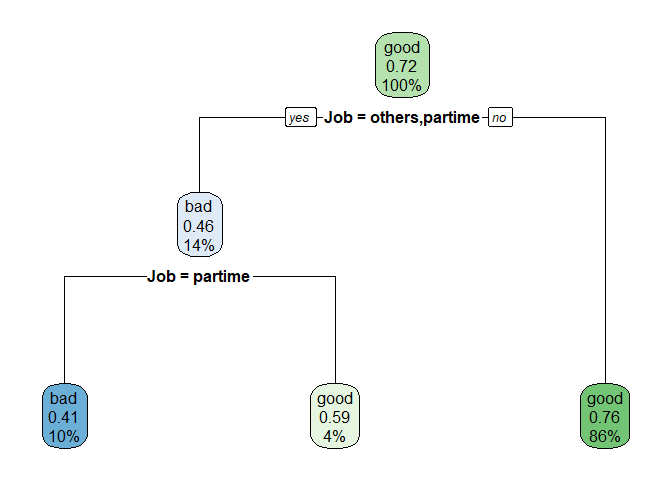

Homework: Building and Evaluating a Classification Model
================
Patrick Torralba
04/07/2026

- [Overview](#overview)
  - [Submission instructions](#submission-instructions)
- [Dataset](#dataset)
  - [Load and inspect the data](#load-and-inspect-the-data)
  - [Initial orientation](#initial-orientation)
  - [The dataset has 4454 rows and 14 columns. Most of the variables are
    numerical but a handful such as status, home, marital, records, and
    job are categorical predictors. The outcome is categorical (e.g good
    / bad). Variables that are useful for prediction include job,
    expenses, income, assests, debt, amount, and
    price.](#the-dataset-has-4454-rows-and-14-columns-most-of-the-variables-are-numerical-but-a-handful-such-as-status-home-marital-records-and-job-are-categorical-predictors-the-outcome-is-categorical-eg-good--bad-variables-that-are-useful-for-prediction-include-job-expenses-income-assests-debt-amount-and-price)
- [Part 1: Understanding the Classification
  Problem](#part-1-understanding-the-classification-problem)
  - [1.1 Identify the outcome](#11-identify-the-outcome)
  - [1.2 Examine class balance](#12-examine-class-balance)
- [Part 2: Prepare the Data](#part-2-prepare-the-data)
  - [2.1 Create a train/test split](#21-create-a-traintest-split)
  - [2.2 Choose predictors](#22-choose-predictors)
- [Part 3: Build a Logistic Regression
  Classifier](#part-3-build-a-logistic-regression-classifier)
  - [3.1 Specify the model](#31-specify-the-model)
  - [3.2 Build a workflow](#32-build-a-workflow)
  - [3.3 Fit the model](#33-fit-the-model)
- [Part 4: Generate Predictions](#part-4-generate-predictions)
- [Part 5: Evaluate the Logistic Regression
  Model](#part-5-evaluate-the-logistic-regression-model)
  - [5.1 Confusion matrix](#51-confusion-matrix)
  - [5.2 Performance metrics](#52-performance-metrics)
- [Part 6: Visualize Model Performance with
  ggplot2](#part-6-visualize-model-performance-with-ggplot2)
  - [6.1 Confusion matrix heatmap using
    counts](#61-confusion-matrix-heatmap-using-counts)
  - [6.2 Confusion matrix heatmap using
    proportions](#62-confusion-matrix-heatmap-using-proportions)
  - [6.3 Probability distribution
    plot](#63-probability-distribution-plot)
- [Part 7: ROC Curve and AUC](#part-7-roc-curve-and-auc)
- [Part 8: Build a Second Model](#part-8-build-a-second-model)
  - [8.1 Specify and fit a decision
    tree](#81-specify-and-fit-a-decision-tree)
  - [8.2 Visualize the tree](#82-visualize-the-tree)
  - [8.3 Generate predictions for the
    tree](#83-generate-predictions-for-the-tree)
  - [8.4 Evaluate the tree](#84-evaluate-the-tree)
- [Part 9: Reflection](#part-9-reflection)
- [Submission](#submission)

``` r
library(tidymodels)
library(tidyverse)
library(modeldata)
library(rpart.plot)
library(psych)

set.seed(25)
```

# Overview

In this assignment, you will build a **classification workflow from
scratch** using a new dataset. AS with each homeowrk,w e are graduall
stepping back the scaffolding as you get stronger as individual
programmers. In this homework, you will need to make some modeling
choices on your own and explain them clearly.

Your work should show that you can:

- identify and describe a classification problem
- split data into training and testing sets
- build a classification model using `tidymodels`
- generate both class predictions and probability predictions
- evaluate a classifier with a confusion matrix, metrics, and an ROC
  curve
- create your own `ggplot2` visualizations of model performance
- compare two different classification models
- reflect on your modeling decisions

You should write code in the code chunks and write your written
responses in the spaces provided.

Before you begin the assignment:

1.  Knit this document and make sure it runs.
2.  Update the author name in the YAML.
3.  Commit and push your work regularly as you go.

## Submission instructions

- Complete this file by adding code and short written responses where
  requested.
- Knit to a GitHub (`md`) document.
- Submit both the `.Rmd` file and the knitted `.md` file by committing
  to your repository.

# Dataset

For this homework, use the **`credit_data`** dataset from the
`modeldata` package.

The outcome you will model is whether an applicant is a **good** or
**bad** credit risk.

## Load and inspect the data

Use the chunk below to load the data and inspect its structure.

``` r
data(credit_data)
glimpse(credit_data)
```

    ## Rows: 4,454
    ## Columns: 14
    ## $ Status    <fct> good, good, bad, good, good, good, good, good, good, bad, go…
    ## $ Seniority <int> 9, 17, 10, 0, 0, 1, 29, 9, 0, 0, 6, 7, 8, 19, 0, 0, 15, 33, …
    ## $ Home      <fct> rent, rent, owner, rent, rent, owner, owner, parents, owner,…
    ## $ Time      <int> 60, 60, 36, 60, 36, 60, 60, 12, 60, 48, 48, 36, 60, 36, 18, …
    ## $ Age       <int> 30, 58, 46, 24, 26, 36, 44, 27, 32, 41, 34, 29, 30, 37, 21, …
    ## $ Marital   <fct> married, widow, married, single, single, married, married, s…
    ## $ Records   <fct> no, no, yes, no, no, no, no, no, no, no, no, no, no, no, yes…
    ## $ Job       <fct> freelance, fixed, freelance, fixed, fixed, fixed, fixed, fix…
    ## $ Expenses  <int> 73, 48, 90, 63, 46, 75, 75, 35, 90, 90, 60, 60, 75, 75, 35, …
    ## $ Income    <int> 129, 131, 200, 182, 107, 214, 125, 80, 107, 80, 125, 121, 19…
    ## $ Assets    <int> 0, 0, 3000, 2500, 0, 3500, 10000, 0, 15000, 0, 4000, 3000, 5…
    ## $ Debt      <int> 0, 0, 0, 0, 0, 0, 0, 0, 0, 0, 0, 0, 2500, 260, 0, 0, 0, 2000…
    ## $ Amount    <int> 800, 1000, 2000, 900, 310, 650, 1600, 200, 1200, 1200, 1150,…
    ## $ Price     <int> 846, 1658, 2985, 1325, 910, 1645, 1800, 1093, 1957, 1468, 15…

## Initial orientation

In a few sentences, describe what you notice about the dataset.

Prompt yourself with these questions:

- What is the name of the outcome variable?
- Is the outcome categorical or numeric?
- Do you see a mix of numeric and categorical predictors?
- Does anything stand out as potentially useful for prediction?

**Response:**

## The dataset has 4454 rows and 14 columns. Most of the variables are numerical but a handful such as status, home, marital, records, and job are categorical predictors. The outcome is categorical (e.g good / bad). Variables that are useful for prediction include job, expenses, income, assests, debt, amount, and price.

# Part 1: Understanding the Classification Problem

## 1.1 Identify the outcome

Write code that helps you explore the outcome variable.

Your code should:

- identify the outcome variable
- show its values
- help you determine whether this is a classification problem

``` r
summary(credit_data$Status)
```

    ##  bad good 
    ## 1254 3200

``` r
ggplot(credit_data, aes(x = Status, fill = Job)) +
  geom_bar() +
  facet_wrap(~ Job) +
  labs(x = "Credit Status",
       y = "Count",
       fill = "Job Type",
       title = "Credit Status by Job Type")
```

<!-- -->

After running your code, answer the following:

1.  What is the name of the outcome variable?
2.  What are the possible classes?
3.  Why is this a classification problem rather than a regression
    problem?

**Response:**

The name of the outcome variable is Status. The possible classes are
either good or bad. This is a classification problem because Status is a
binary variable - it can only be good or bad - and we are interested in
predicting the probability of an individual either being classified into
good or bad.

## 1.2 Examine class balance

Create:

- a table of the outcome variable
- a bar plot of the outcome variable

``` r
credit_data %>% 
  count(Status) %>% 
  mutate(Percent = (n / sum(n)) *100)
```

    ##   Status    n  Percent
    ## 1    bad 1254 28.15447
    ## 2   good 3200 71.84553

``` r
ggplot(credit_data, aes(x = Status, fill = Status)) +
  geom_bar()
```

<!-- -->

Then answer:

- Is the dataset balanced across the two classes, or is one class more
  common?
- Why might class balance matter when evaluating a classifier?
- Why might accuracy be misleading if one class is much more common?

**Response:**

The dataset is not balanced. There are more people with good credit than
bad credit. Class balance matters when evaluating because this directly
impacts accuracy. To be specific, since the classes are imbalanced, a
logistic regression model only learns to predict the majority class
(good), and not the minority class (bad). Accuracy may be misleading
because we can only be accurate pertaining to the good credit since we
have alot of data on it. But, we cannot be accurate on the bad credit
since there isn’t alot of data to go off of.

------------------------------------------------------------------------

# Part 2: Prepare the Data

## 2.1 Create a train/test split

Split the data into **training** and **testing** sets.

Expectations:

- Use an 80/20 split.
- Use `set.seed(123)` if needed again.
- Use **stratification on the outcome variable** so that class
  proportions are preserved.

``` r
set.seed(123)

data_split <- initial_split(credit_data,
                    prop = 0.80,
                    strata = Status)

train_data <- training(data_split)

test_data <- testing(data_split)
```

Then answer:

- Why do we split data into training and testing sets?
- Why is stratifying on the outcome useful in this case?

**Response:**

We split data into training and testing datasets because we are trying
to train the model by using the training data. And then we assess the
model by verifying it with the testing data. Stratifying is useful
because it ensures that we have an equal distribution of Status across
both datasets.

## 2.2 Choose predictors

You will begin by building a **logistic regression model** using **at
least 3 predictors** of your choice.

Before you write the model, briefly explain:

- which predictors you plan to use
- why you chose them
- whether there are any variables you intentionally decided not to use

You do **not** need to choose the “best” predictors, but your choices
should be thoughtful and clearly explained.

**Response:**

I choose the following predictor variables: Income, Debt, and Job. I
selected these variables because I believe they can strongly influence
an individual’s credit status. For example, an individual’s job and
income direclty impacts their spending habits, and thus to a degree,
their credit status. I chose not to use variables like age, marital, and
seniority because I felt that they weren’t as powerful predictors as the
the aforementioend selected variables.

------------------------------------------------------------------------

# Part 3: Build a Logistic Regression Classifier

## 3.1 Specify the model

Create a **logistic regression specification** using `tidymodels`.

``` r
log_spec <- logistic_reg() %>% 
  set_engine("glm") %>% 
  set_mode("classification") 
```

## 3.2 Build a workflow

Create a workflow that:

- adds your model
- adds a formula with the outcome and your chosen predictors

``` r
log_workflow <- workflow() %>% 
  add_model(log_spec) %>% 
  add_formula(Status ~ Income + Job + Debt)

log_workflow
```

    ## ══ Workflow ════════════════════════════════════════════════════════════════════
    ## Preprocessor: Formula
    ## Model: logistic_reg()
    ## 
    ## ── Preprocessor ────────────────────────────────────────────────────────────────
    ## Status ~ Income + Job + Debt
    ## 
    ## ── Model ───────────────────────────────────────────────────────────────────────
    ## Logistic Regression Model Specification (classification)
    ## 
    ## Computational engine: glm

## 3.3 Fit the model

Fit your workflow on the training data.

``` r
log_fit <- log_workflow %>% 
  fit(data = credit_data)


log_fit
```

    ## ══ Workflow [trained] ══════════════════════════════════════════════════════════
    ## Preprocessor: Formula
    ## Model: logistic_reg()
    ## 
    ## ── Preprocessor ────────────────────────────────────────────────────────────────
    ## Status ~ Income + Job + Debt
    ## 
    ## ── Model ───────────────────────────────────────────────────────────────────────
    ## 
    ## Call:  stats::glm(formula = ..y ~ ., family = stats::binomial, data = data)
    ## 
    ## Coefficients:
    ##  (Intercept)        Income  Jobfreelance     Jobothers    Jobpartime  
    ##    0.7887455     0.0045931    -0.2695671    -0.7958487    -1.6497260  
    ##         Debt  
    ##   -0.0000644  
    ## 
    ## Degrees of Freedom: 4061 Total (i.e. Null);  4056 Residual
    ##   (392 observations deleted due to missingness)
    ## Null Deviance:       4602 
    ## Residual Deviance: 4255  AIC: 4267

Then answer:

- Why are we fitting on the training set and not the full dataset?
- What is the benefit of keeping the model and formula inside a
  workflow?

**Response:**

We are fitting data on the training set only because we are training our
model to recognize patterns. If we used the entire dataset then we’d
have no test data to verify our model since the model has access to the
entire dataset. The benefit of keeping the model and formula inside a
workflow is that we can apply this model to different datasets (e.g
another credit_data dataset).

------------------------------------------------------------------------

# Part 4: Generate Predictions

Use your fitted logistic regression model to generate predictions on the
**test** set.

You should generate:

- predicted probabilities
- predicted classes

Then combine those predictions with the original test data.

``` r
log_credit_status_preds <- predict(log_fit, new_data = test_data)

log_credit_prob_preds <-predict(log_fit, new_data = test_data, type = "prob")

log_results <- test_data %>% 
  select(Status) %>% 
  bind_cols(log_credit_status_preds, log_credit_prob_preds)


head(log_results)
```

    ##   Status .pred_class .pred_bad .pred_good
    ## 1    bad        good 0.1918861  0.8081139
    ## 2   good        good 0.2037719  0.7962281
    ## 3   good        good 0.2668543  0.7331457
    ## 4    bad         bad 0.5655888  0.4344112
    ## 5   good        good 0.1949750  0.8050250
    ## 6    bad        good 0.2352033  0.7647967

After generating predictions, answer:

- What is the difference between a predicted probability and a predicted
  class?
- Why is it useful to keep both?

**Response:**

A predicted probability gives the decimal value of the likelihood an
individual is to either have good credit or bad credit. The predicted
class is an absolute that is determined by the good / bad decimal value.
For example, if the predicted good value is higher than the predicted
bad value, then the predicted status is good.

It is useful to keep both because the probabilities allow you to see how
the distribution whereas the class is needed for an absolute
interpretation.

------------------------------------------------------------------------

# Part 5: Evaluate the Logistic Regression Model

## 5.1 Confusion matrix

Create a confusion matrix for your logistic regression predictions on
the test set.

``` r
log_results %>% 
  conf_mat(truth = Status, estimate = .pred_class)
```

    ##           Truth
    ## Prediction bad good
    ##       bad   45   23
    ##       good 165  587

Then answer:

- What do the rows represent?
- What do the columns represent?
- Where do correct predictions appear?
- What kinds of mistakes does your model make?

**Response:**

The rows represent the actual values whereas the columns represent the
predicted values. The correct predictions are located on the symmetrical
intersections (e.g bad x bad and good x good). The model can make false
negatives and false positive mistakes.

## 5.2 Performance metrics

Use `metrics()` to calculate performance measures for your logistic
regression model.

``` r
log_results %>% 
  metrics(truth = Status, estimate = .pred_class)
```

    ## # A tibble: 2 × 3
    ##   .metric  .estimator .estimate
    ##   <chr>    <chr>          <dbl>
    ## 1 accuracy binary         0.771
    ## 2 kap      binary         0.227

Then answer:

- What is the accuracy?
- What other metrics are shown?
- Is accuracy alone enough to judge performance here? Why or why not?

**Response:**

Accuracy is how close the model was from estimating the actual values.
The other metric is kap. Accuracy alone is not enough to judge
performance considering our model is only 77% accurate. We need to
evaluate the ROC AUC as well.

------------------------------------------------------------------------

# Part 6: Visualize Model Performance with ggplot2

In class, we discussed that a confusion matrix can be treated like a
dataset and visualized using the grammar of graphics. In this section,
build your own performance visualizations rather than relying only on
built-in plots.

## 6.1 Confusion matrix heatmap using counts

Create a `ggplot2` heatmap of the confusion matrix using **counts**.

Expectations:

- convert the confusion matrix to a tibble
- map predicted class to one axis and true class to the other
- use `geom_tile()`
- display the count in each cell with `geom_text()`

``` r
cm <- log_results %>% 
  conf_mat(truth = Status, estimate = .pred_class) 


cm_df <- as.data.frame(cm$table)

ggplot(cm_df, aes(x = Prediction, y = Truth, fill = Freq)) +
  geom_tile(alpha = 0.5) +
  geom_text(aes(label = Freq), color = "black", size = 5) +
  labs(x = "Predicted Classes",
       y = "True Class",
       fill = "Count",
       title = "Confusion Matrix")
```

<!-- -->

Then answer:

- What variable did you map to `fill`?
- Why is `geom_tile()` appropriate here?
- What patterns are easiest to notice in this version?

**Response:**

I mapped the the Freq variable to fill so it would show the counts in my
geom_tile() plot. Geom_tile is appropriate because we are showing a 2x2
table that shows a visualization of how accurate our model is. The
patterns that are super easy to notice are the counts and colors. For
example, it is very easy to see that our good x good cell has 587 counts
and is light blue.

## 6.2 Confusion matrix heatmap using proportions

Now create a second version of the confusion matrix plot using
**proportions within each true class** instead of raw counts.

This means you should:

- group by the true class
- calculate a proportion for each cell within that class
- plot those proportions in a heatmap
- label cells with rounded proportions

``` r
conf_prop_status_conf_mat <- conf_mat(log_results, truth = Status, estimate = .pred_class)


conf_prop_status_df <- as.data.frame(conf_prop_status_conf_mat$table) %>% 
  group_by(Truth) %>% 
  mutate(prop = (Freq / sum(Freq)))
  

ggplot(conf_prop_status_df, aes(x = Prediction, y = Truth, fill = Freq)) +
  geom_tile() +
  geom_text(aes(label = round(prop, 2)), color = "black") +
  labs(
    x = "Predicted Classes",
    y = "True Class",
    fill = "Proportion",
    title = "Confusion Matrix (proportions)"
    
  )
```

<!-- -->

Then answer:

- Why might proportions be more useful than counts?
- What would strong performance look like in this plot?
- Do the proportions suggest similar performance across both classes?

**Response:**

Proportions might be more useful than counts because we can compare the
false positives and false negatives against the true values. A strong
performance would look like having really high proportion values and
very light blue colors in the bad x bad and the good x good cells. The
proportions do not suggest similar performances across both classes.
This matrix indicates that the model is really effective at predicting
“Good” credit status but ineffective at predicting “Bad” credit status.

## 6.3 Probability distribution plot

Create a plot showing predicted probabilities by actual class.

A histogram is one good option, but you may choose another `ggplot2`
visualization if you prefer.

Your goal is to show how well the model separates the classes based on
predicted probability.

``` r
ggplot(log_results, aes(x = .pred_good, fill = Status)) +
  geom_density() +
  labs(x = "Predicted Probability of 'Good'",
       y = "Density",
       fill = "True Status",
       title = "Predicted Probablity Distribution by True Status")
```

    ## Warning: Removed 71 rows containing non-finite outside the scale range
    ## (`stat_density()`).

<!-- -->

Then answer:

- How well does your model separate the two classes?
- Where do you see overlap?
- What does overlap suggest about misclassification?

**Response:**

It appears that the model is unable to separate the two classes well.
The peaks for good and bad are somewhat close to each other, and thus,
this represents that the model has difficulty differentiating the two
classes. I see the overlap occurring at the 70% probability for “Good”.
This overlap represents a false negative and a false positive. A false
negative for every “bad” individual that falls to the right of 0.5, and
a false positive for every “good” falling left of 0.5.

------------------------------------------------------------------------

# Part 7: ROC Curve and AUC

Use your logistic regression predictions to create an ROC curve and
calculate AUC.

Your code should:

- create an ROC curve using the probability for the positive class
- plot the ROC curve
- calculate AUC

``` r
roc_curve_data <- roc_curve(log_results, truth = Status, .pred_bad)

autoplot(roc_curve_data)
```

<!-- -->

``` r
roc_auc(log_results, truth = Status, .pred_bad)
```

    ## # A tibble: 1 × 3
    ##   .metric .estimator .estimate
    ##   <chr>   <chr>          <dbl>
    ## 1 roc_auc binary         0.688

Then answer:

- What does the ROC curve show that the confusion matrix does not?
- What is your AUC value?
- How would you interpret that AUC value in plain language?

**Response:**

The ROC curve shows the model’s true positive rate against the false
positive rate. In other words, the ROC curve is good at comparing the
true and false positive rates, whereas the confusion matrix only shows
us how people were classified (e.g count or proportion of people into
good or bad). The AUC value is 0.688 which means our model is only 68.8%
accurate when predicting an individual’s status.

------------------------------------------------------------------------

# Part 8: Build a Second Model

In this section, you will build a **decision tree classifier** using the
**same predictors** you used in logistic regression. This will allow a
fairer comparison between the two models.

## 8.1 Specify and fit a decision tree

Create a decision tree model using `decision_tree()` with the `rpart`
engine.

Then build a workflow and fit it on the training data.

``` r
tree_model <- decision_tree() %>% 
  set_engine("rpart") %>% 
  set_mode("classification")

tree_workflow <- workflow() %>% 
  add_model(tree_model) %>% 
  add_formula(Status ~ Income + Job + Debt)

tree_fit <- fit(tree_workflow, data = train_data)
```

Then answer:

- How is a decision tree conceptually different from logistic
  regression?
- What kinds of patterns might a tree capture more easily?

**Response:**

A decision tree is different from logistic regression because it splits
off based on different scenarios (e.g a series of if-then statements).
Whereas, logistic regression is inherently a 0-1 probability curve, how
close an individual can be classified as “Good”. Trees are good at
capturing non-linear relationships. For example, a tree is good at using
if-then statements to classify different classifications based on
varying factor levels of an income threshold.

## 8.2 Visualize the tree

Visualize your fitted tree using `rpart.plot()`.

``` r
tree_fit %>% 
  extract_fit_engine() %>% 
  rpart.plot()
```

    ## Warning: Cannot retrieve the data used to build the model (so cannot determine roundint and is.binary for the variables).
    ## To silence this warning:
    ##     Call rpart.plot with roundint=FALSE,
    ##     or rebuild the rpart model with model=TRUE.

<!-- -->

Then answer:

- What variable appears in the first split?
- What do the terminal nodes represent?
- Why might a tree be easier to interpret than logistic regression?

**Response:**

The variable that appears in the first split is job. The terminal nodes
represent the final prediction for a group of people based on the above
variables. A tree may be easier to interpret because we can easily
visualize how an individual is classified as good or bad. For example,
we can see in this tree the variables which influence an individual’s
status as bad (e.g having a part-time job).

## 8.3 Generate predictions for the tree

Create both probability and class predictions for the tree on the test
set, then combine them with the test data.

``` r
tree_preds <- predict(tree_fit, test_data, type = "prob") %>% 
  bind_cols(predict(tree_fit, test_data)) %>% 
  bind_cols(test_data)

tree_preds
```

    ## # A tibble: 891 × 17
    ##    .pred_bad .pred_good .pred_class Status Seniority Home     Time   Age Marital
    ##        <dbl>      <dbl> <fct>       <fct>      <int> <fct>   <int> <int> <fct>  
    ##  1     0.238      0.762 good        bad           10 owner      36    46 married
    ##  2     0.238      0.762 good        good          29 owner      60    44 married
    ##  3     0.238      0.762 good        good           0 owner      60    32 married
    ##  4     0.588      0.412 bad         bad            0 ignore     48    36 married
    ##  5     0.238      0.762 good        good           1 parents    60    31 single 
    ##  6     0.238      0.762 good        bad            3 owner      24    23 married
    ##  7     0.238      0.762 good        good           4 owner      48    29 married
    ##  8     0.238      0.762 good        good           7 owner      48    32 married
    ##  9     0.238      0.762 good        good          24 owner      60    42 married
    ## 10     0.238      0.762 good        bad            0 owner      60    32 married
    ## # ℹ 881 more rows
    ## # ℹ 8 more variables: Records <fct>, Job <fct>, Expenses <int>, Income <int>,
    ## #   Assets <int>, Debt <int>, Amount <int>, Price <int>

## 8.4 Evaluate the tree

Evaluate the tree using:

- a confusion matrix
- `metrics()`

``` r
conf_mat(tree_preds, truth = Status, estimate = .pred_class)
```

    ##           Truth
    ## Prediction bad good
    ##       bad   51   27
    ##       good 200  613

``` r
metrics(tree_preds, truth = Status, estimate = .pred_class)
```

    ## # A tibble: 2 × 3
    ##   .metric  .estimator .estimate
    ##   <chr>    <chr>          <dbl>
    ## 1 accuracy binary         0.745
    ## 2 kap      binary         0.204

Then answer:

- How does the tree perform compared to logistic regression?
- Which model has stronger performance?
- Which model is easier to interpret?
- If you had to choose one of the two models, which would you choose and
  why?

**Response:**

Compared to the logistic regression, the tree is less accurate. The
former has 77.1% accuracy whereas the later is at 74.5% accuracy.
However, the tree model is easier to interpret, and I’d choose the tree
model because we can how variables such as Job can directly influence an
individuals likelihood to be classified as either good or bad.

------------------------------------------------------------------------

# Part 9: Reflection

Write full-sentence responses to the following:

1.  What was the most challenging part of this assignment?
2.  What modeling decisions did you make that may have affected
    performance?
3.  If you had more time, what would you try next?
4.  How could this workflow apply to your own research, professional
    work, or interests?

**Response:**

1.  The most challenging part of this assignment was interpreting our
    model outputs such as the confusion matrix, ROC curves, and the
    decision tree.

2.  Selecting predictor variables such as Job, Income, and Debt affected
    the performance of the model. It is highly likely that an
    individual’s job and income are correlated and thus, the model’s
    accuracy may be higher than we anticipate due to this correlation.

3.  If I had more time, I would try accounting for the interaction
    effect between variables by creating interaction terms in my model.

4.  This workflow is incredibly applicative to my own research because I
    am able to create logistic regression models and tree decisions that
    isn’t based on BaseR. And, I am able to interpret my model’s output
    more effectively, in terms of a logistic regression, since I can see
    how each terminal node came to be.

------------------------------------------------------------------------

# Submission

Submit:

1.  your completed `.Rmd` file
2.  your knitted HTML file

Make sure that:

- all code runs from top to bottom
- all plots appear in the knitted output
- your written responses are included
- your file is clearly named
